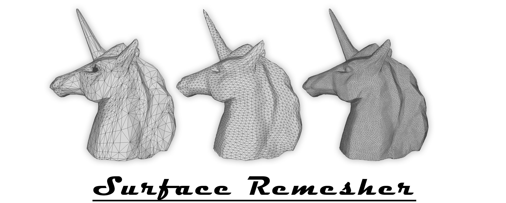

  

Surface Remesher remeshes a surface mesh using the centroidal Voronoi tessellation. The input is a triangulated surface mesh. We first cut the surface into a topological disk, then parameterize it in a planar space. We compute the centroidal Voronoi tessellation (CVT) in the parameter space with respect to a density distribution, and construct the constrained Delaunay triangulation (CDT) from the resulted CVT. The final optimized surface mesh is then obtained from CDT.

---

We use the following packages:

1. [CGAL 5.0.2](https://www.cgal.org) to store the mesh structure, and
2. with [Eigen 3.3.7](http://eigen.tuxfamily.org) to parameterize the surface mesh;
3. [gCVT](https://www.comp.nus.edu.sg/~tants/cvt.html) to compute the centroidal Voronoi tessellation on the GPU;
4. [gDel2D](https://www.comp.nus.edu.sg/~tants/gdel3d.html) to compute the constrained Delaunay triangulation on the GPU.

Please preinstall CGAL and Eigen, and compile it as a CUDA project.

---

1. [Jiaqi Zheng and Tiow-Seng Tan. 2020. Computing Centroidal Voronoi Tessellation Using the GPU. In Symposium on Interactive 3D Graphics and Games (I3D ’20), May 5–7, 2020, San Francisco, CA, USA.](https://doi.org/10.1145/3384382.3384520)
